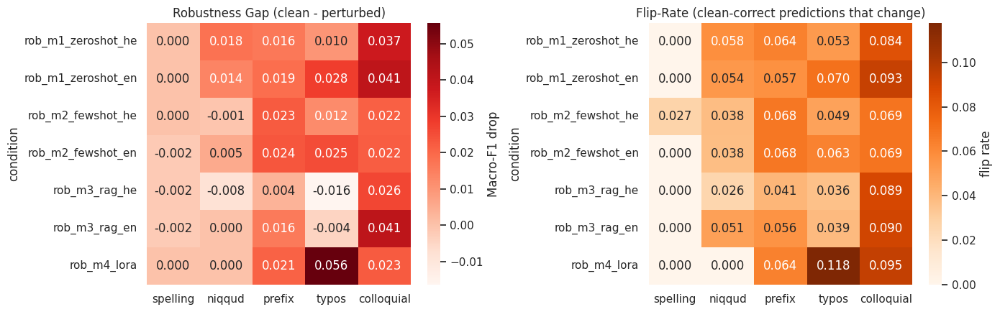
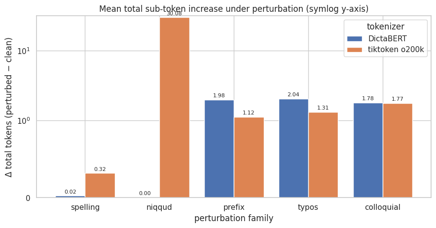

# Robustness of Hebrew Sentiment Analysis to Meaning-Preserving Orthographic Variation

*Prompting vs. fine-tuning — final project for Transformers and Large Language Models (2026), by Barak Tal and Itamar Saacks.*

Hebrew spelling varies in ways a native reader treats as identical: full vs. defective spelling (ktiv male/haser), optional niqqud, clitic prefixes, and casual typing. This project asks a different question from "which model is most accurate?": **which Hebrew sentiment method is most robust to meaning-preserving spelling variation, and why?**

## What we did

- **Four methods** on a frozen, class-balanced 500-example subset of [`HebArabNlpProject/HebrewSentiment`](https://huggingface.co/datasets/HebArabNlpProject/HebrewSentiment) (3 classes):
  zero-shot Claude Haiku 4.5, few-shot Claude, retrieval-augmented (RAG) Claude, and a LoRA-fine-tuned [DictaBERT](https://huggingface.co/dicta-il/dictabert). Prompting methods run with both Hebrew and English instructions (7 conditions total).
- **A deterministic perturbation suite** with five families: spelling (ktiv male/haser), niqqud (Dicta Nakdan), prefix segmentation, typos / final-letter normalization, and colloquial paraphrase.
- **Metrics:** Robustness Gap (Macro-F1 drop) and a label-independent Flip-Rate.
- **Mechanistic analysis:** does tokenizer fragmentation (DictaBERT WordPiece, tiktoken o200k, Claude's measured input tokens) explain which predictions flip?

## Key findings

| Question | Finding |
|---|---|
| Most robust method? | **RAG-augmented prompting**: smallest gaps and flip-rates on the rule-based families. |
| LoRA-DictaBERT | Perfectly invariant to spelling and niqqud, yet the **most fragile to final-form typos** (gap 0.056, flip-rate 0.118). |
| Hebrew vs. English instructions? | No consistent advantage. |
| Does tokenization explain fragility? | **No.** Niqqud adds about 30 tokens under BPE and 0 under DictaBERT, but flips don't correlate with token change (all \|r\| < 0.05). |



*Cooler is more robust. The RAG rows are the coolest on the rule-based families, and LoRA's typos cell is the clear hotspot in both panels.*



*Niqqud shatters an English-centric BPE tokenizer but leaves DictaBERT's Hebrew WordPiece untouched. Yet token change does not predict which predictions flip.*

Clean Macro-F1: RAG-EN 0.858, RAG-HE 0.845, LoRA 0.844, zero-/few-shot about 0.80–0.81. The full robustness sweep (about 18k Haiku calls) cost about $1 thanks to a disk cache.

## Repository layout

```
notebooks/hebrew_sentiment_robustness.ipynb   full pipeline, runs end to end (written for Colab, T4 GPU)
docs/report.pdf                               written report
docs/slides.pdf                               presentation slides
assets/                                       figures used in this README
```

## Running it

Open the notebook in Google Colab with a GPU runtime. It reads two secrets, `ANTHROPIC_API_KEY` and `HF_TOKEN`, from Colab secrets or environment variables, so none are stored in the notebook. Model outputs are cached, so reruns are cheap and deterministic.

## Authors

Barak Tal and Itamar Saacks.
